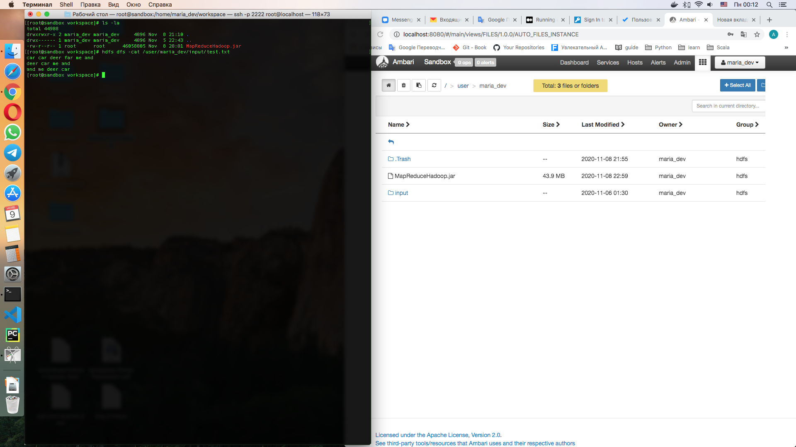
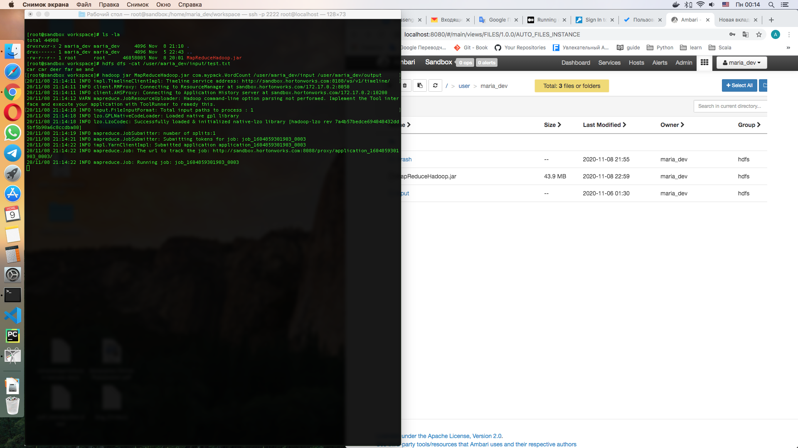
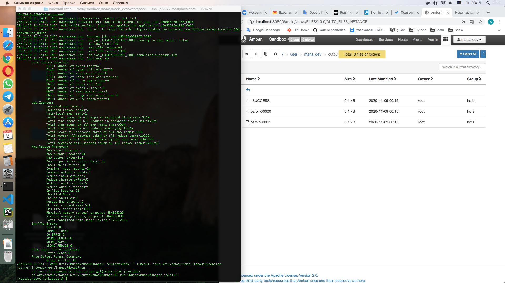
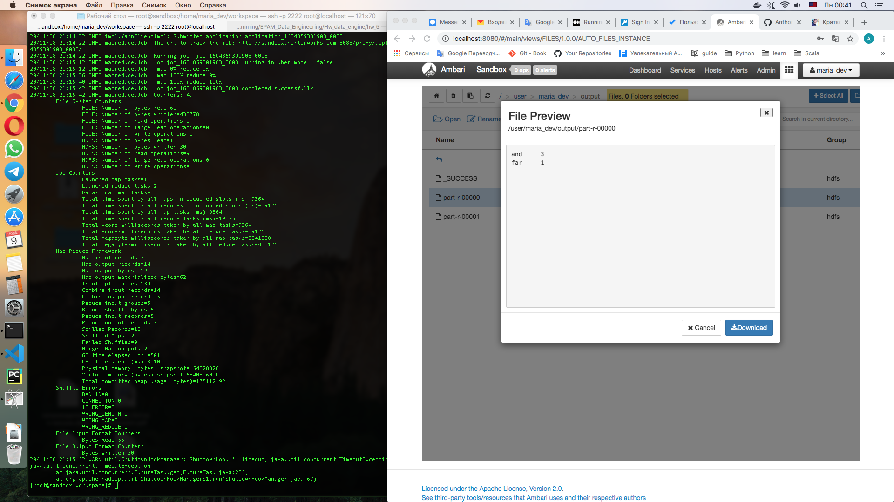

# Word Count with Hadoop

## Short description

Two reduce tasks were set. Custom partitioner was used with default algorithm (HashPartitioner).

Jar file is stored by path 'MapReduceHadoop/out/artifacts/MapReduceHadoop_jar/MapReduceHadoop.jar'

Java file is stored by path 'MapReduceHadoop/src/com/mypack/WordCount.java'

Project steps:

1. Having a jar file and input folder with test.txt file in HDFS (Initial state)

2. Starting a job by command: `hadoop jar MapReduceHadoop.jar com.mypack.WordCount /user/maria_dev/input /user/maria_dev/output`

3. Finally, an output folder with two result files

Content of first file

Content of second file
